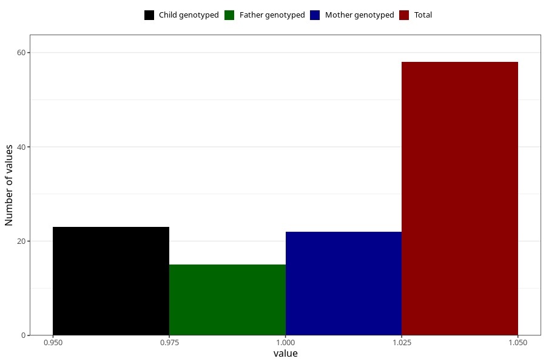

# hospitalized_amniotic_fluid_leakage_after_29w
Variable mapping to questionnaire: q3, question CC163.
- Number of values:

| Value | Total | Child genotyped | Mother genotyped | Father genotyped |
| ----- | ----- | --------------- | ---------------- | ---------------- |
| Missing | 113565 | 75408 | 71747 | 50203 |
| Non-missing | 58 | 23 | 22 | 15 |
| 1 | 58 | 23 | 22 | 15 |

