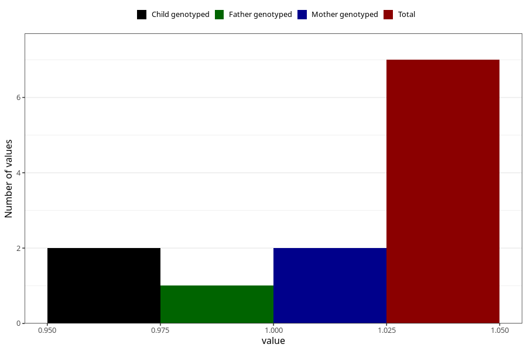

# hospitalized_bleeding_0_4w
Variable mapping to questionnaire: q3, question CC147.
- Number of values:

| Value | Total | Child genotyped | Mother genotyped | Father genotyped |
| ----- | ----- | --------------- | ---------------- | ---------------- |
| Missing | 113616 | 83353 | 71767 | 50217 |
| Non-missing | 7 | 2 | 2 | 1 |
| 1 | 7 | 2 | 2 | 1 |

