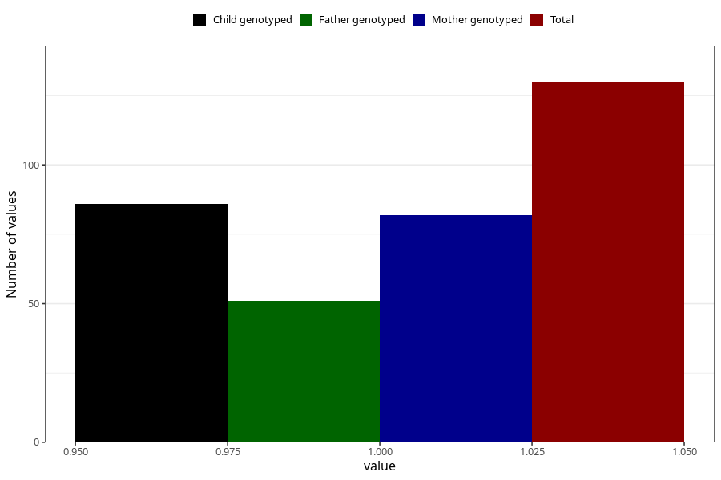

# hospitalized_bleeding_13_16w
Variable mapping to questionnaire: q3, question CC150.
- Number of values:

| Value | Total | Child genotyped | Mother genotyped | Father genotyped |
| ----- | ----- | --------------- | ---------------- | ---------------- |
| Missing | 113493 | 83257 | 71687 | 50167 |
| Non-missing | 130 | 98 | 82 | 51 |
| 1 | 130 | 98 | 82 | 51 |

