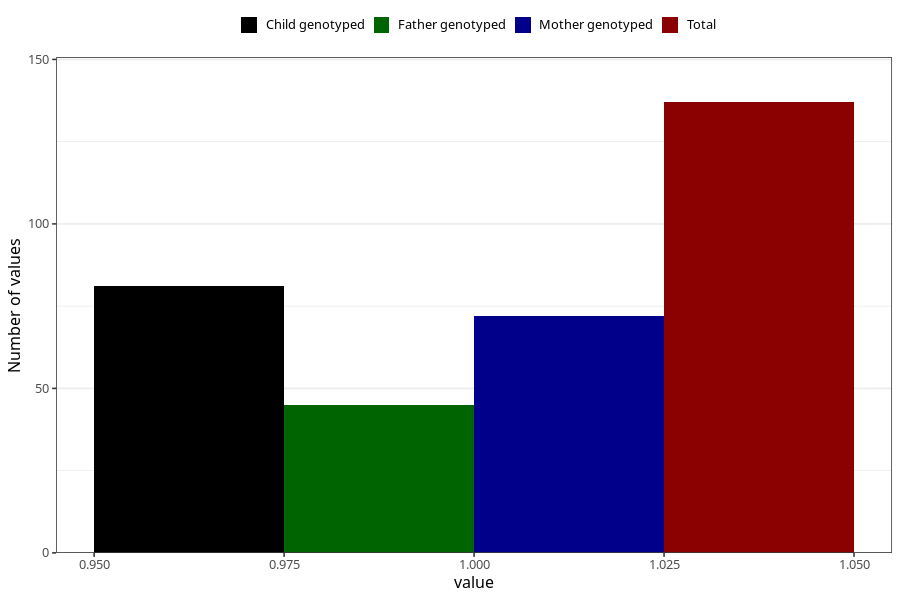

# hospitalized_bleeding_21_24w
Variable mapping to questionnaire: q3, question CC152.
- Number of values:

| Value | Total | Child genotyped | Mother genotyped | Father genotyped |
| ----- | ----- | --------------- | ---------------- | ---------------- |
| Missing | 113486 | 75350 | 71697 | 50173 |
| Non-missing | 137 | 81 | 72 | 45 |
| 1 | 137 | 81 | 72 | 45 |

