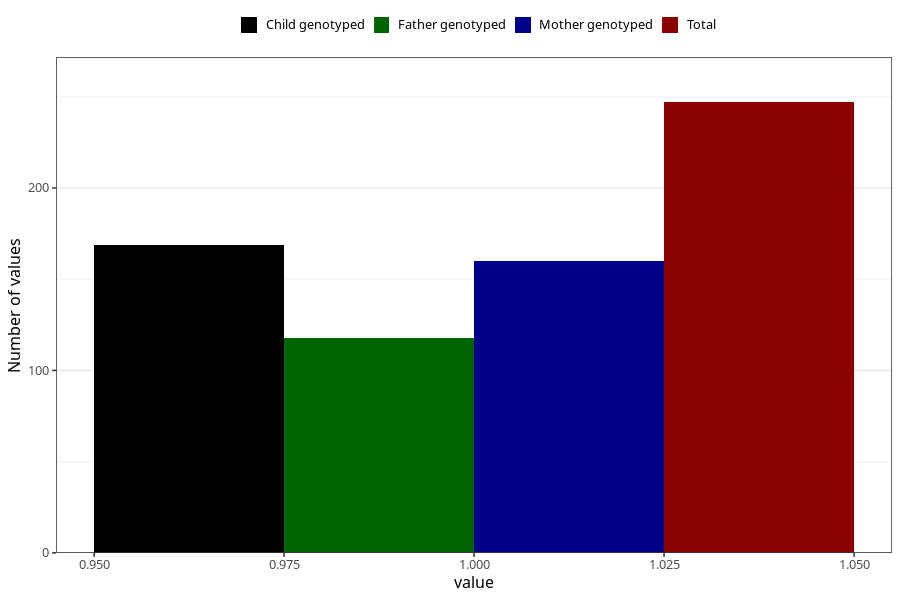

# hospitalized_bleeding_25_28w
Variable mapping to questionnaire: q3, question CC153.
- Number of values:

| Value | Total | Child genotyped | Mother genotyped | Father genotyped |
| ----- | ----- | --------------- | ---------------- | ---------------- |
| Missing | 113376 | 75262 | 71609 | 50100 |
| Non-missing | 247 | 169 | 160 | 118 |
| 1 | 247 | 169 | 160 | 118 |

