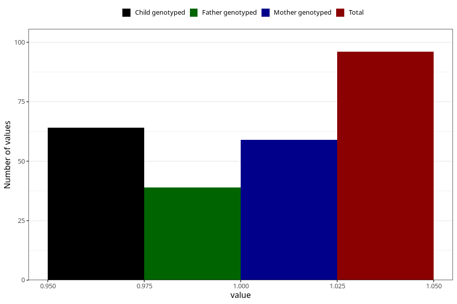

# hospitalized_bleeding_9_12w
Variable mapping to questionnaire: q3, question CC149.
- Number of values:

| Value | Total | Child genotyped | Mother genotyped | Father genotyped |
| ----- | ----- | --------------- | ---------------- | ---------------- |
| Missing | 113527 | 83276 | 71710 | 50179 |
| Non-missing | 96 | 79 | 59 | 39 |
| 1 | 96 | 79 | 59 | 39 |

