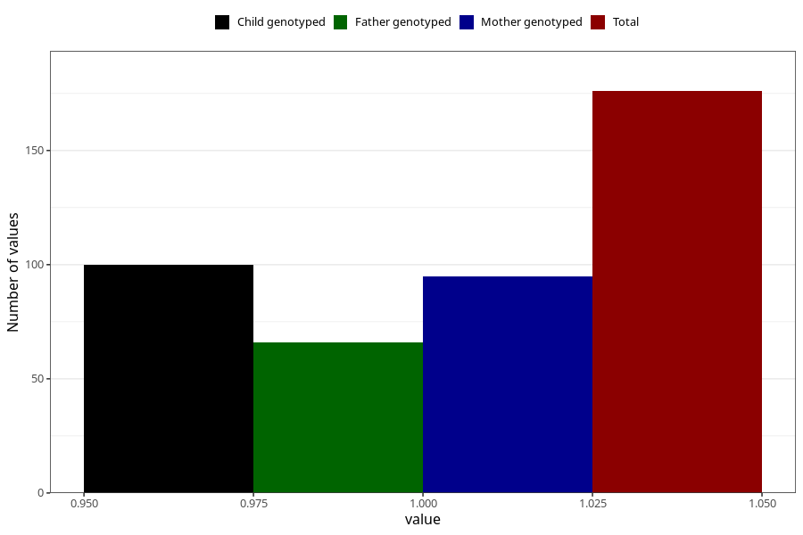

# hospitalized_bleeding_after_29w
Variable mapping to questionnaire: q3, question CC154.
- Number of values:

| Value | Total | Child genotyped | Mother genotyped | Father genotyped |
| ----- | ----- | --------------- | ---------------- | ---------------- |
| Missing | 113447 | 83242 | 71674 | 50152 |
| Non-missing | 176 | 113 | 95 | 66 |
| 1 | 176 | 113 | 95 | 66 |

