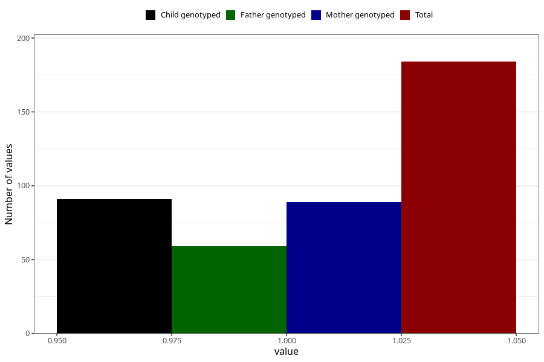

# hospitalized_high_blood_pressure
Variable mapping to questionnaire: q3, question CC173.
- Number of values:

| Value | Total | Child genotyped | Mother genotyped | Father genotyped |
| ----- | ----- | --------------- | ---------------- | ---------------- |
| Missing | 113439 | 83255 | 71680 | 50159 |
| Non-missing | 184 | 100 | 89 | 59 |
| 1 | 184 | 100 | 89 | 59 |

