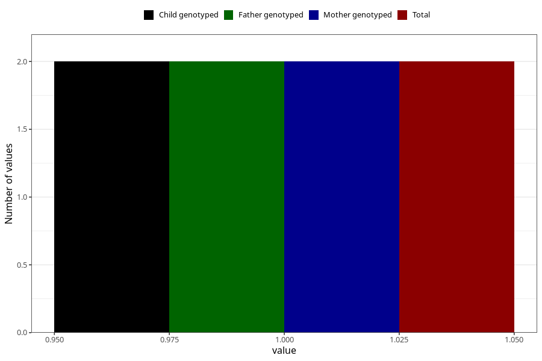

# hospitalized_high_blood_pressure_0_4w
Variable mapping to questionnaire: q3, question CC174.
- Number of values:

| Value | Total | Child genotyped | Mother genotyped | Father genotyped |
| ----- | ----- | --------------- | ---------------- | ---------------- |
| Missing | 113621 | 75429 | 71767 | 50216 |
| Non-missing | 2 | 2 | 2 | 2 |
| 1 | 2 | 2 | 2 | 2 |

