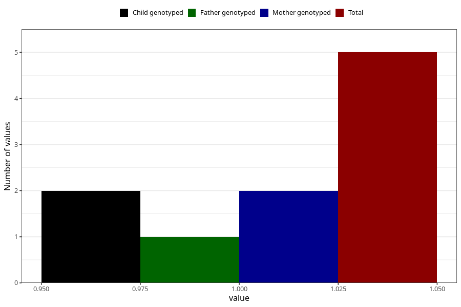

# hospitalized_high_blood_pressure_13_16w
Variable mapping to questionnaire: q3, question CC177.
- Number of values:

| Value | Total | Child genotyped | Mother genotyped | Father genotyped |
| ----- | ----- | --------------- | ---------------- | ---------------- |
| Missing | 113618 | 83352 | 71767 | 50217 |
| Non-missing | 5 | 3 | 2 | 1 |
| 1 | 5 | 3 | 2 | 1 |

