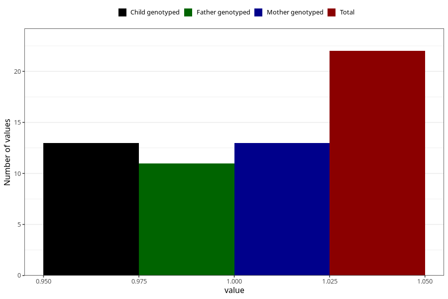

# hospitalized_high_blood_pressure_21_24w
Variable mapping to questionnaire: q3, question CC179.
- Number of values:

| Value | Total | Child genotyped | Mother genotyped | Father genotyped |
| ----- | ----- | --------------- | ---------------- | ---------------- |
| Missing | 113601 | 75418 | 71756 | 50207 |
| Non-missing | 22 | 13 | 13 | 11 |
| 1 | 22 | 13 | 13 | 11 |

