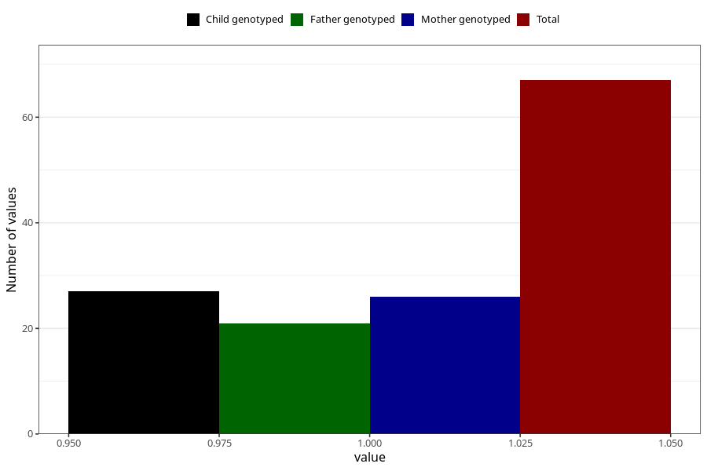

# hospitalized_high_blood_pressure_25_28w
Variable mapping to questionnaire: q3, question CC180.
- Number of values:

| Value | Total | Child genotyped | Mother genotyped | Father genotyped |
| ----- | ----- | --------------- | ---------------- | ---------------- |
| Missing | 113556 | 75404 | 71743 | 50197 |
| Non-missing | 67 | 27 | 26 | 21 |
| 1 | 67 | 27 | 26 | 21 |

