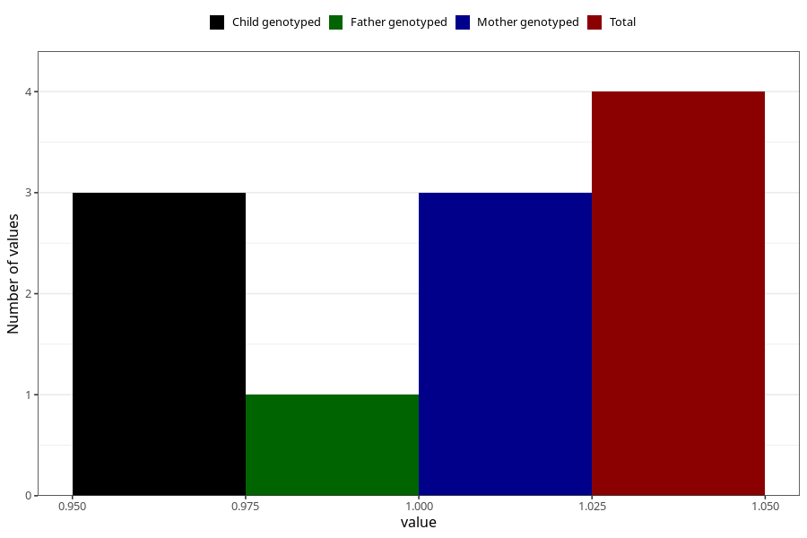

# hospitalized_high_blood_pressure_5_8w
Variable mapping to questionnaire: q3, question CC175.
- Number of values:

| Value | Total | Child genotyped | Mother genotyped | Father genotyped |
| ----- | ----- | --------------- | ---------------- | ---------------- |
| Missing | 113619 | 83351 | 71766 | 50217 |
| Non-missing | 4 | 4 | 3 | 1 |
| 1 | 4 | 4 | 3 | 1 |

