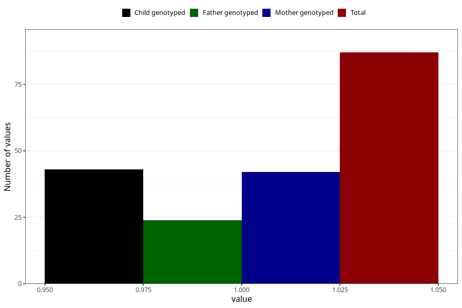

# hospitalized_high_blood_pressure_after_29w
Variable mapping to questionnaire: q3, question CC181.
- Number of values:

| Value | Total | Child genotyped | Mother genotyped | Father genotyped |
| ----- | ----- | --------------- | ---------------- | ---------------- |
| Missing | 113536 | 83306 | 71727 | 50194 |
| Non-missing | 87 | 49 | 42 | 24 |
| 1 | 87 | 49 | 42 | 24 |

