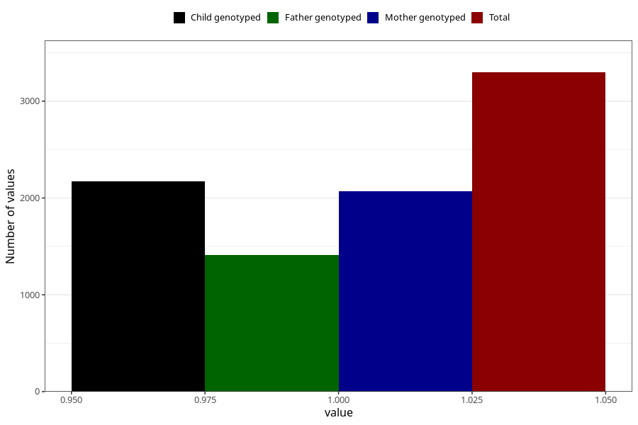

# hospitalized_other
Variable mapping to questionnaire: q3, question CC191.
- Number of values:

| Value | Total | Child genotyped | Mother genotyped | Father genotyped |
| ----- | ----- | --------------- | ---------------- | ---------------- |
| Missing | 110326 | 80917 | 69700 | 48805 |
| Non-missing | 3297 | 2438 | 2069 | 1413 |
| 1 | 3297 | 2438 | 2069 | 1413 |

