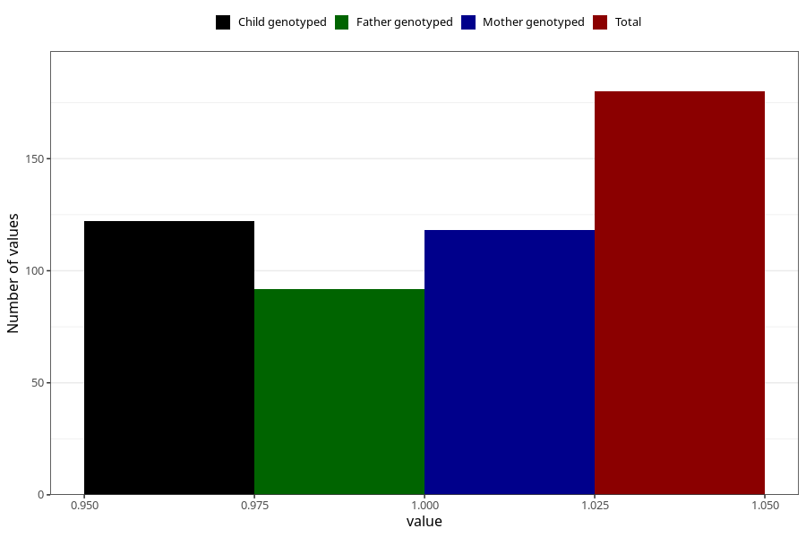

# hospitalized_other_0_4w
Variable mapping to questionnaire: q3, question CC192.
- Number of values:

| Value | Total | Child genotyped | Mother genotyped | Father genotyped |
| ----- | ----- | --------------- | ---------------- | ---------------- |
| Missing | 113443 | 83213 | 71651 | 50126 |
| Non-missing | 180 | 142 | 118 | 92 |
| 1 | 180 | 142 | 118 | 92 |

