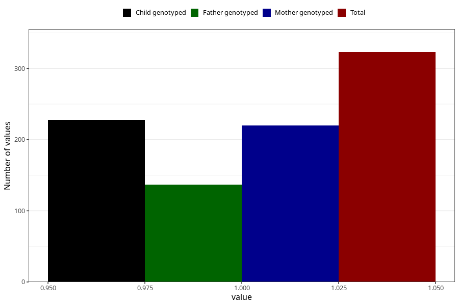

# hospitalized_other_13_16w
Variable mapping to questionnaire: q3, question CC195.
- Number of values:

| Value | Total | Child genotyped | Mother genotyped | Father genotyped |
| ----- | ----- | --------------- | ---------------- | ---------------- |
| Missing | 113300 | 83102 | 71549 | 50081 |
| Non-missing | 323 | 253 | 220 | 137 |
| 1 | 323 | 253 | 220 | 137 |

