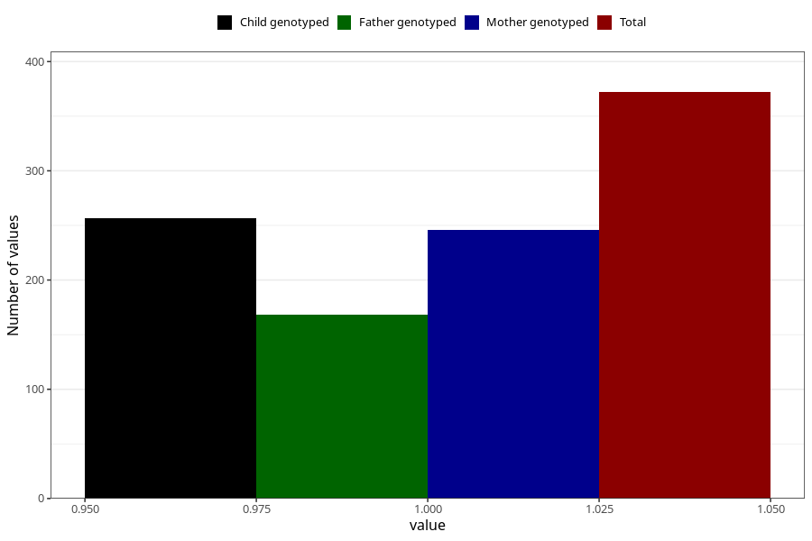

# hospitalized_other_17_20w
Variable mapping to questionnaire: q3, question CC196.
- Number of values:

| Value | Total | Child genotyped | Mother genotyped | Father genotyped |
| ----- | ----- | --------------- | ---------------- | ---------------- |
| Missing | 113251 | 83076 | 71523 | 50050 |
| Non-missing | 372 | 279 | 246 | 168 |
| 1 | 372 | 279 | 246 | 168 |

