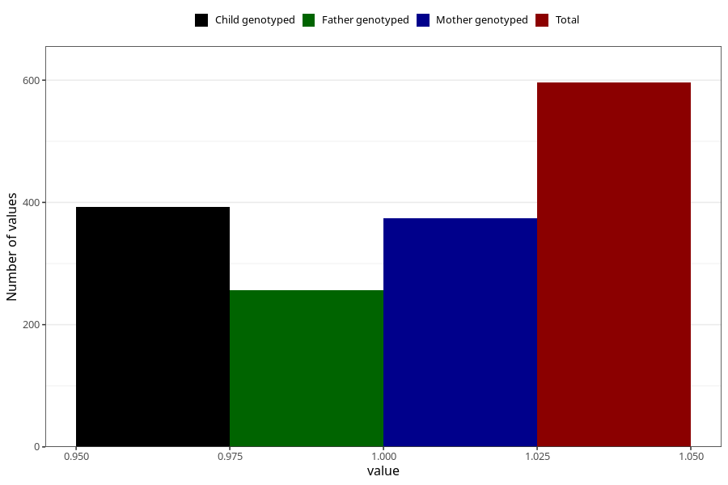

# hospitalized_other_21_24w
Variable mapping to questionnaire: q3, question CC197.
- Number of values:

| Value | Total | Child genotyped | Mother genotyped | Father genotyped |
| ----- | ----- | --------------- | ---------------- | ---------------- |
| Missing | 113027 | 82911 | 71395 | 49961 |
| Non-missing | 596 | 444 | 374 | 257 |
| 1 | 596 | 444 | 374 | 257 |

