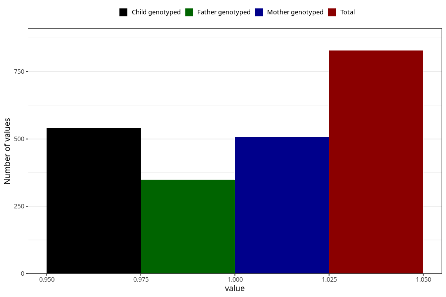

# hospitalized_other_25_28w
Variable mapping to questionnaire: q3, question CC198.
- Number of values:

| Value | Total | Child genotyped | Mother genotyped | Father genotyped |
| ----- | ----- | --------------- | ---------------- | ---------------- |
| Missing | 112795 | 82759 | 71262 | 49870 |
| Non-missing | 828 | 596 | 507 | 348 |
| 1 | 828 | 596 | 507 | 348 |

