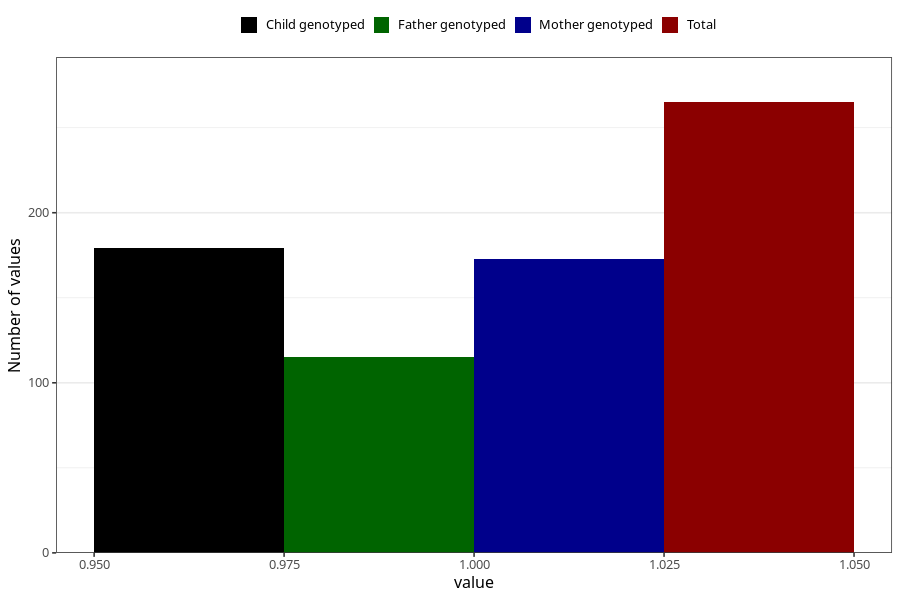

# hospitalized_other_5_8w
Variable mapping to questionnaire: q3, question CC193.
- Number of values:

| Value | Total | Child genotyped | Mother genotyped | Father genotyped |
| ----- | ----- | --------------- | ---------------- | ---------------- |
| Missing | 113358 | 75252 | 71596 | 50103 |
| Non-missing | 265 | 179 | 173 | 115 |
| 1 | 265 | 179 | 173 | 115 |

