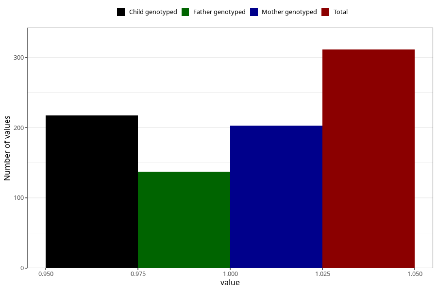

# hospitalized_other_9_12w
Variable mapping to questionnaire: q3, question CC194.
- Number of values:

| Value | Total | Child genotyped | Mother genotyped | Father genotyped |
| ----- | ----- | --------------- | ---------------- | ---------------- |
| Missing | 113312 | 83115 | 71566 | 50081 |
| Non-missing | 311 | 240 | 203 | 137 |
| 1 | 311 | 240 | 203 | 137 |

