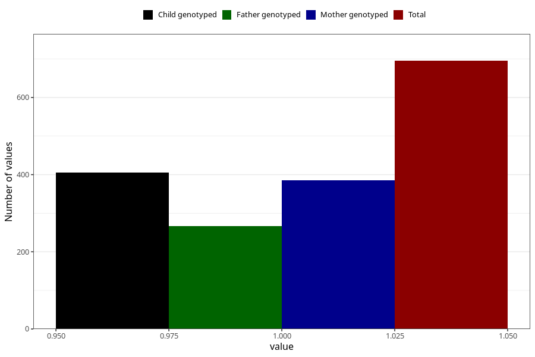

# hospitalized_other_after_29w
Variable mapping to questionnaire: q3, question CC199.
- Number of values:

| Value | Total | Child genotyped | Mother genotyped | Father genotyped |
| ----- | ----- | --------------- | ---------------- | ---------------- |
| Missing | 112928 | 82889 | 71383 | 49951 |
| Non-missing | 695 | 466 | 386 | 267 |
| 1 | 695 | 466 | 386 | 267 |

