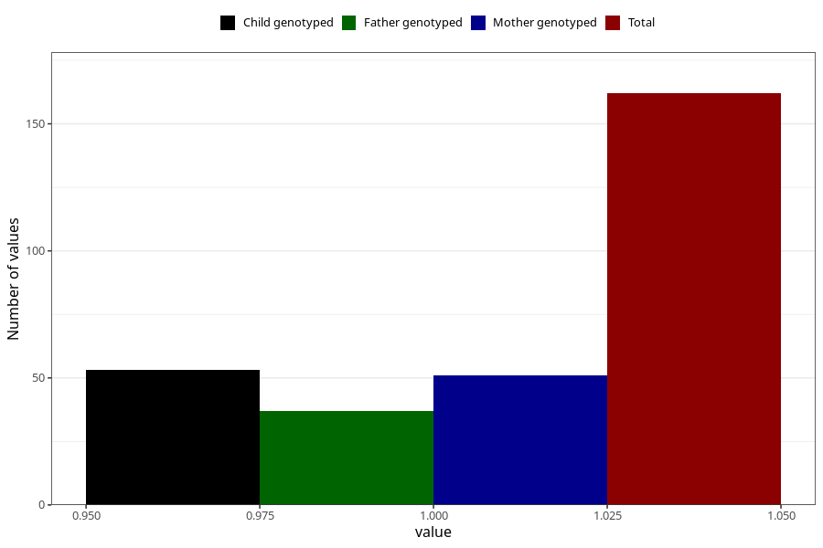

# hospitalized_pre_eclampsia
Variable mapping to questionnaire: q3, question CC182.
- Number of values:

| Value | Total | Child genotyped | Mother genotyped | Father genotyped |
| ----- | ----- | --------------- | ---------------- | ---------------- |
| Missing | 113461 | 75378 | 71718 | 50181 |
| Non-missing | 162 | 53 | 51 | 37 |
| 1 | 162 | 53 | 51 | 37 |

