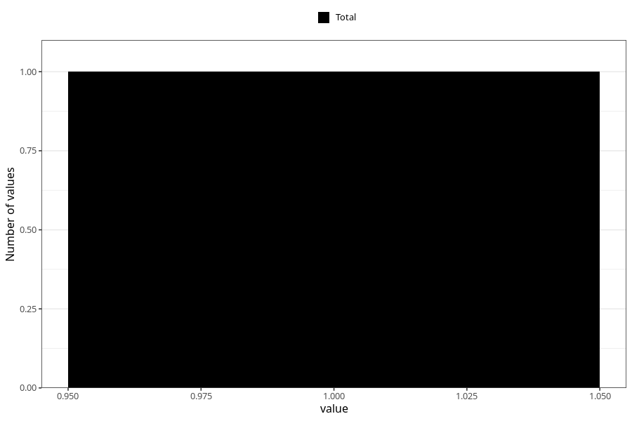

# hospitalized_pre_eclampsia_0_4w
Variable mapping to questionnaire: q3, question CC183.
- Number of values:

| Value | Total | Child genotyped | Mother genotyped | Father genotyped |
| ----- | ----- | --------------- | ---------------- | ---------------- |
| Missing | 113622 | 83355 | 71769 | 50218 |
| Non-missing | 1 | 0 | 0 | 0 |
| 1 | 1 | 0 | 0 | 0 |

