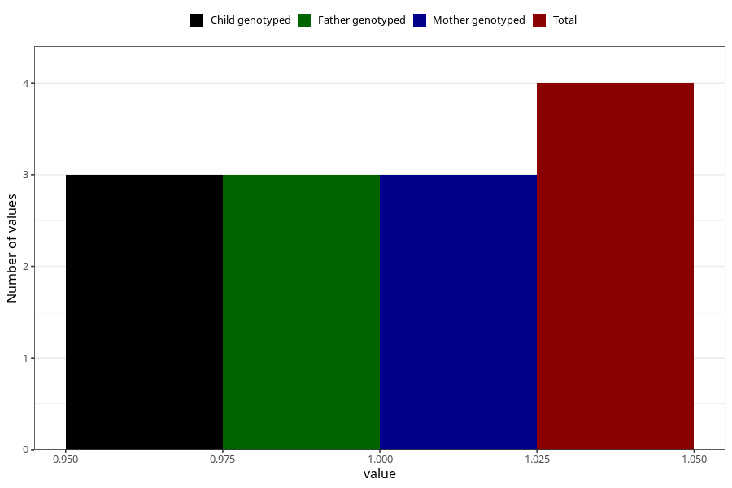

# hospitalized_pre_eclampsia_17_20w
Variable mapping to questionnaire: q3, question CC187.
- Number of values:

| Value | Total | Child genotyped | Mother genotyped | Father genotyped |
| ----- | ----- | --------------- | ---------------- | ---------------- |
| Missing | 113619 | 75428 | 71766 | 50215 |
| Non-missing | 4 | 3 | 3 | 3 |
| 1 | 4 | 3 | 3 | 3 |

