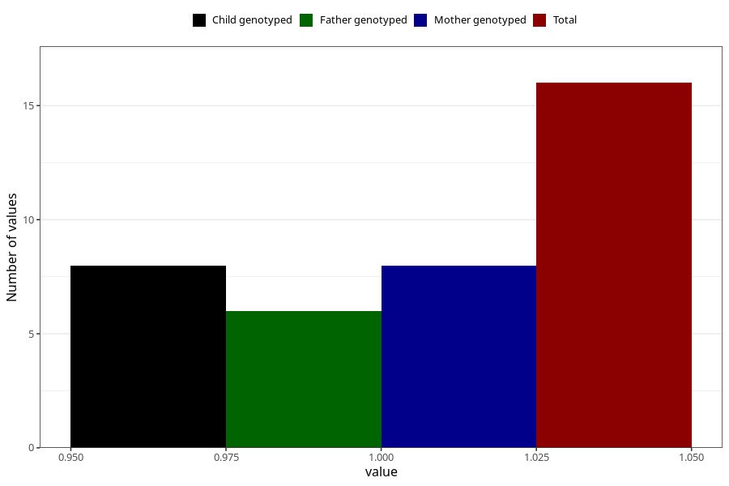

# hospitalized_pre_eclampsia_21_24w
Variable mapping to questionnaire: q3, question CC188.
- Number of values:

| Value | Total | Child genotyped | Mother genotyped | Father genotyped |
| ----- | ----- | --------------- | ---------------- | ---------------- |
| Missing | 113607 | 83347 | 71761 | 50212 |
| Non-missing | 16 | 8 | 8 | 6 |
| 1 | 16 | 8 | 8 | 6 |

