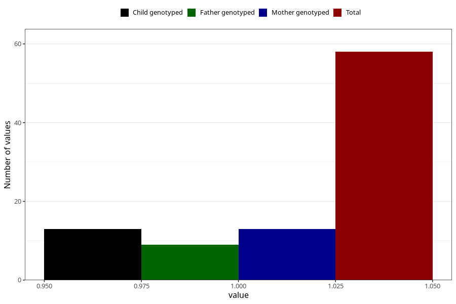

# hospitalized_pre_eclampsia_25_28w
Variable mapping to questionnaire: q3, question CC189.
- Number of values:

| Value | Total | Child genotyped | Mother genotyped | Father genotyped |
| ----- | ----- | --------------- | ---------------- | ---------------- |
| Missing | 113565 | 75418 | 71756 | 50209 |
| Non-missing | 58 | 13 | 13 | 9 |
| 1 | 58 | 13 | 13 | 9 |

