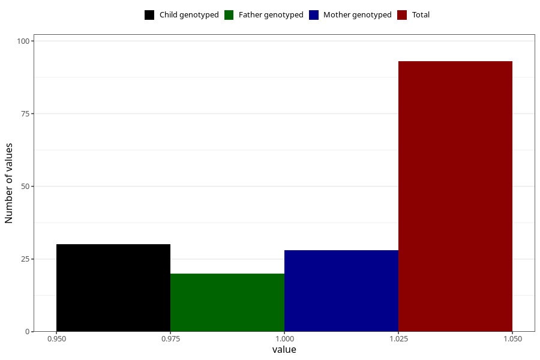

# hospitalized_pre_eclampsia_after_29w
Variable mapping to questionnaire: q3, question CC190.
- Number of values:

| Value | Total | Child genotyped | Mother genotyped | Father genotyped |
| ----- | ----- | --------------- | ---------------- | ---------------- |
| Missing | 113530 | 83322 | 71741 | 50198 |
| Non-missing | 93 | 33 | 28 | 20 |
| 1 | 93 | 33 | 28 | 20 |

