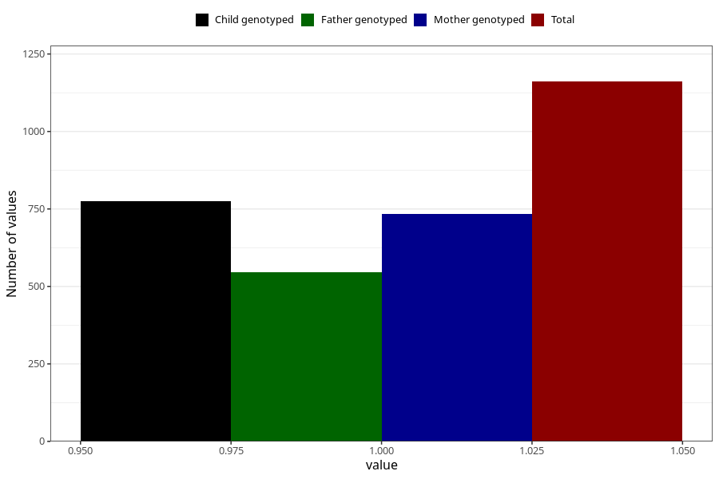

# hospitalized_prolonged_nausea_vomiting
Variable mapping to questionnaire: q3, question CC137.
- Number of values:

| Value | Total | Child genotyped | Mother genotyped | Father genotyped |
| ----- | ----- | --------------- | ---------------- | ---------------- |
| Missing | 112462 | 82474 | 71035 | 49671 |
| Non-missing | 1161 | 881 | 734 | 547 |
| 1 | 1161 | 881 | 734 | 547 |

