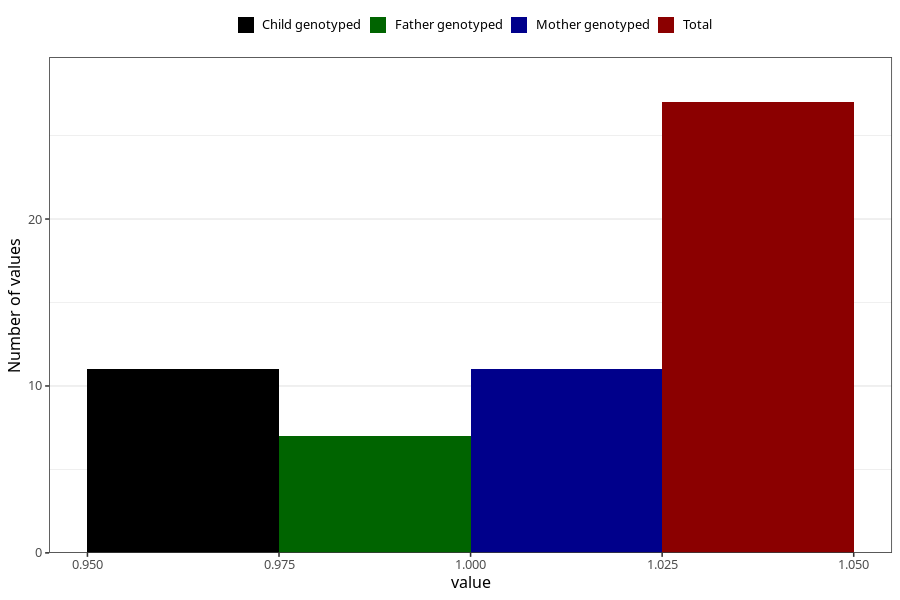

# hospitalized_prolonged_nausea_vomiting_0_4w
Variable mapping to questionnaire: q3, question CC138.
- Number of values:

| Value | Total | Child genotyped | Mother genotyped | Father genotyped |
| ----- | ----- | --------------- | ---------------- | ---------------- |
| Missing | 113596 | 83339 | 71758 | 50211 |
| Non-missing | 27 | 16 | 11 | 7 |
| 1 | 27 | 16 | 11 | 7 |

