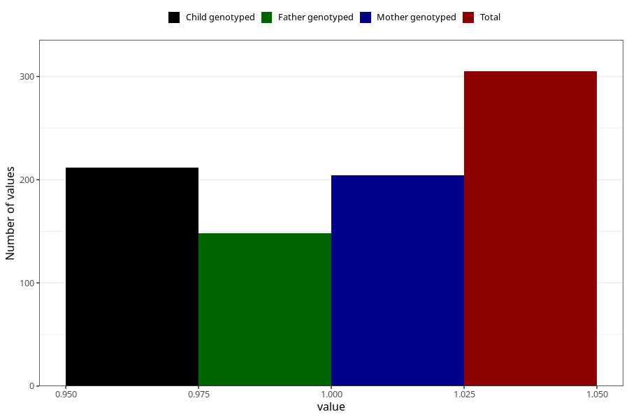

# hospitalized_prolonged_nausea_vomiting_13_16w
Variable mapping to questionnaire: q3, question CC141.
- Number of values:

| Value | Total | Child genotyped | Mother genotyped | Father genotyped |
| ----- | ----- | --------------- | ---------------- | ---------------- |
| Missing | 113318 | 75219 | 71565 | 50070 |
| Non-missing | 305 | 212 | 204 | 148 |
| 1 | 305 | 212 | 204 | 148 |

