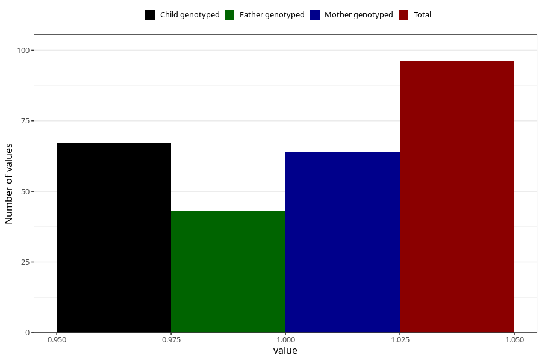

# hospitalized_prolonged_nausea_vomiting_17_20w
Variable mapping to questionnaire: q3, question CC142.
- Number of values:

| Value | Total | Child genotyped | Mother genotyped | Father genotyped |
| ----- | ----- | --------------- | ---------------- | ---------------- |
| Missing | 113527 | 83279 | 71705 | 50175 |
| Non-missing | 96 | 76 | 64 | 43 |
| 1 | 96 | 76 | 64 | 43 |

