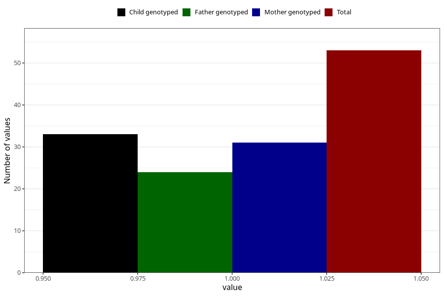

# hospitalized_prolonged_nausea_vomiting_21_24w
Variable mapping to questionnaire: q3, question CC143.
- Number of values:

| Value | Total | Child genotyped | Mother genotyped | Father genotyped |
| ----- | ----- | --------------- | ---------------- | ---------------- |
| Missing | 113570 | 83318 | 71738 | 50194 |
| Non-missing | 53 | 37 | 31 | 24 |
| 1 | 53 | 37 | 31 | 24 |

