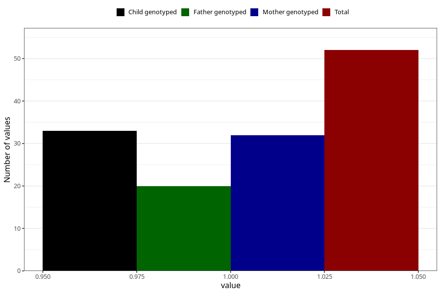

# hospitalized_prolonged_nausea_vomiting_25_28w
Variable mapping to questionnaire: q3, question CC144.
- Number of values:

| Value | Total | Child genotyped | Mother genotyped | Father genotyped |
| ----- | ----- | --------------- | ---------------- | ---------------- |
| Missing | 113571 | 83319 | 71737 | 50198 |
| Non-missing | 52 | 36 | 32 | 20 |
| 1 | 52 | 36 | 32 | 20 |

