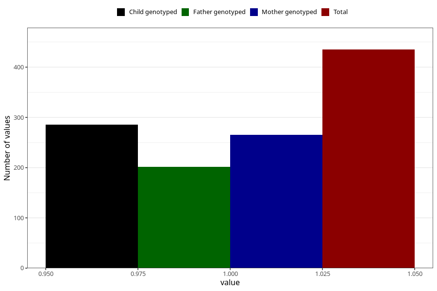

# hospitalized_prolonged_nausea_vomiting_5_8w
Variable mapping to questionnaire: q3, question CC139.
- Number of values:

| Value | Total | Child genotyped | Mother genotyped | Father genotyped |
| ----- | ----- | --------------- | ---------------- | ---------------- |
| Missing | 113188 | 75145 | 71504 | 50016 |
| Non-missing | 435 | 286 | 265 | 202 |
| 1 | 435 | 286 | 265 | 202 |

