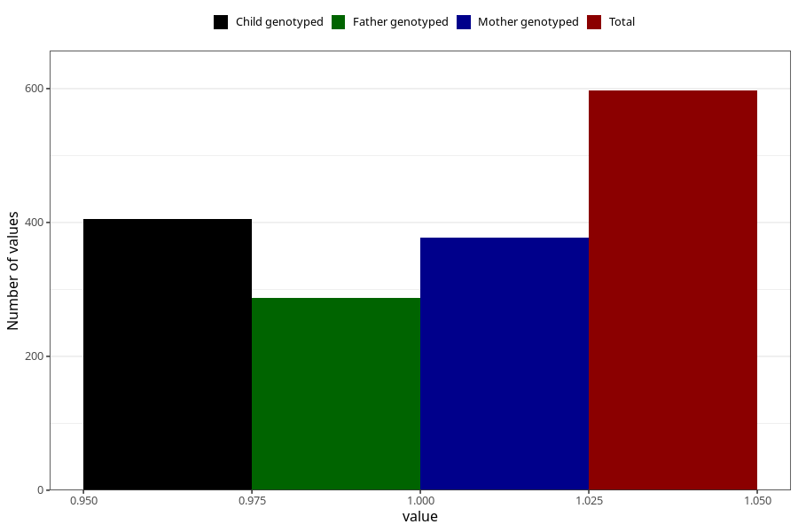

# hospitalized_prolonged_nausea_vomiting_9_12w
Variable mapping to questionnaire: q3, question CC140.
- Number of values:

| Value | Total | Child genotyped | Mother genotyped | Father genotyped |
| ----- | ----- | --------------- | ---------------- | ---------------- |
| Missing | 113026 | 82902 | 71391 | 49931 |
| Non-missing | 597 | 453 | 378 | 287 |
| 1 | 597 | 453 | 378 | 287 |

