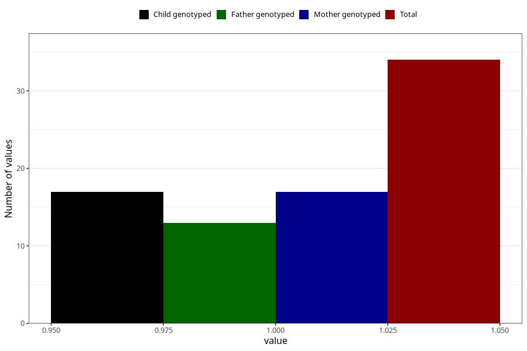

# hospitalized_prolonged_nausea_vomiting_after_29w
Variable mapping to questionnaire: q3, question CC145.
- Number of values:

| Value | Total | Child genotyped | Mother genotyped | Father genotyped |
| ----- | ----- | --------------- | ---------------- | ---------------- |
| Missing | 113589 | 75414 | 71752 | 50205 |
| Non-missing | 34 | 17 | 17 | 13 |
| 1 | 34 | 17 | 17 | 13 |

