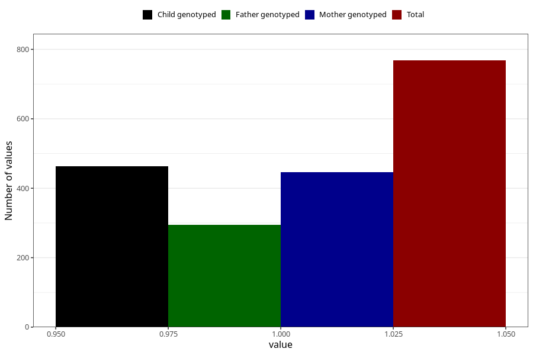

# hospitalized_threatening_preterm_labour
Variable mapping to questionnaire: q3, question CC164.
- Number of values:

| Value | Total | Child genotyped | Mother genotyped | Father genotyped |
| ----- | ----- | --------------- | ---------------- | ---------------- |
| Missing | 112855 | 82828 | 71323 | 49923 |
| Non-missing | 768 | 527 | 446 | 295 |
| 1 | 768 | 527 | 446 | 295 |

