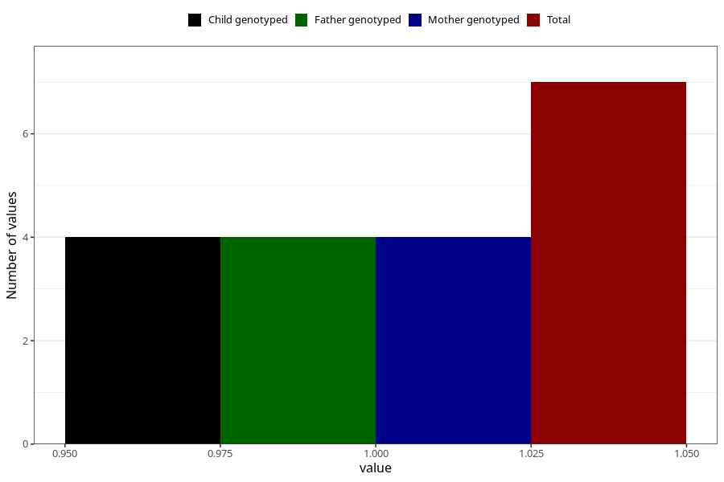

# hospitalized_threatening_preterm_labour_13_16w
Variable mapping to questionnaire: q3, question CC168.
- Number of values:

| Value | Total | Child genotyped | Mother genotyped | Father genotyped |
| ----- | ----- | --------------- | ---------------- | ---------------- |
| Missing | 113616 | 83349 | 71765 | 50214 |
| Non-missing | 7 | 6 | 4 | 4 |
| 1 | 7 | 6 | 4 | 4 |

