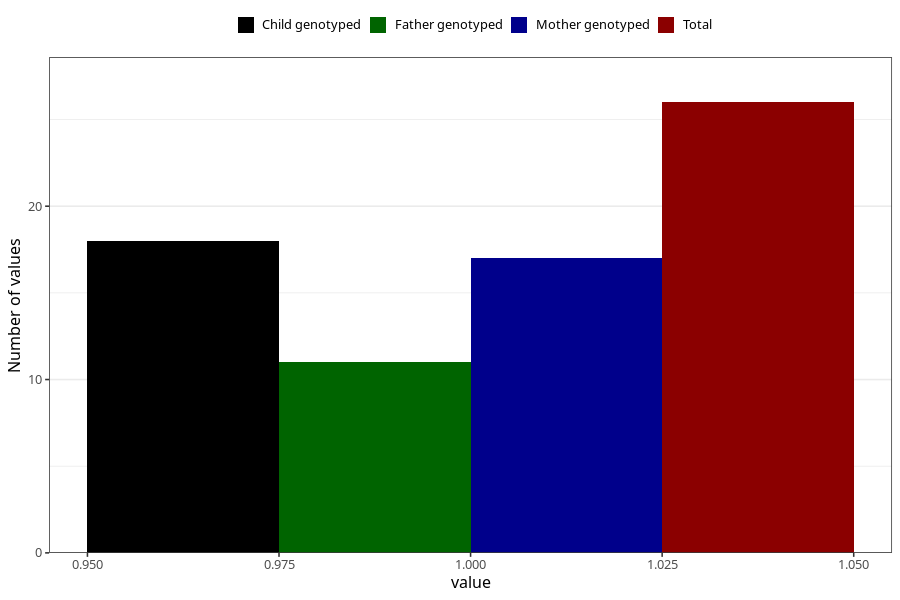

# hospitalized_threatening_preterm_labour_17_20w
Variable mapping to questionnaire: q3, question CC169.
- Number of values:

| Value | Total | Child genotyped | Mother genotyped | Father genotyped |
| ----- | ----- | --------------- | ---------------- | ---------------- |
| Missing | 113597 | 83336 | 71752 | 50207 |
| Non-missing | 26 | 19 | 17 | 11 |
| 1 | 26 | 19 | 17 | 11 |

