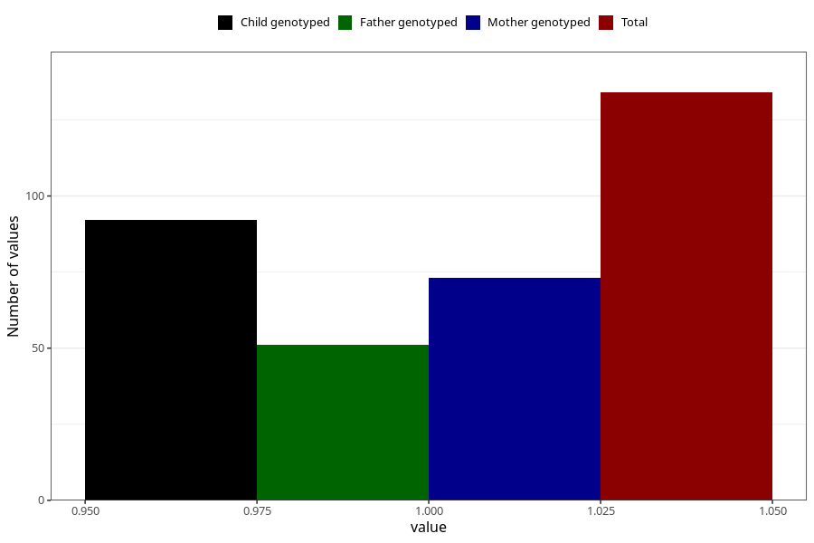

# hospitalized_threatening_preterm_labour_21_24w
Variable mapping to questionnaire: q3, question CC170.
- Number of values:

| Value | Total | Child genotyped | Mother genotyped | Father genotyped |
| ----- | ----- | --------------- | ---------------- | ---------------- |
| Missing | 113489 | 83263 | 71696 | 50167 |
| Non-missing | 134 | 92 | 73 | 51 |
| 1 | 134 | 92 | 73 | 51 |

