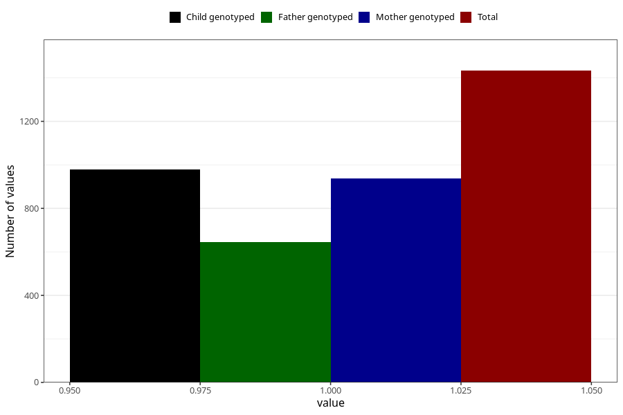

# influenza_5w_8w
Variable mapping to questionnaire: q1m, question AA377.
- Number of values:

| Value | Total | Child genotyped | Mother genotyped | Father genotyped |
| ----- | ----- | --------------- | ---------------- | ---------------- |
| Missing | 112190 | 74452 | 70830 | 49573 |
| Non-missing | 1433 | 979 | 939 | 645 |
| 1 | 1433 | 979 | 939 | 645 |

