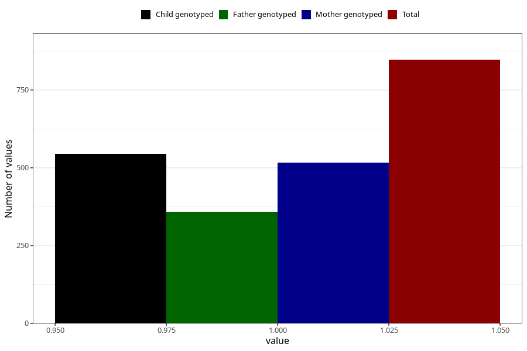

# influenza_before_4w
Variable mapping to questionnaire: q1m, question AA376.
- Number of values:

| Value | Total | Child genotyped | Mother genotyped | Father genotyped |
| ----- | ----- | --------------- | ---------------- | ---------------- |
| Missing | 112776 | 74886 | 71252 | 49860 |
| Non-missing | 847 | 545 | 517 | 358 |
| 1 | 847 | 545 | 517 | 358 |

