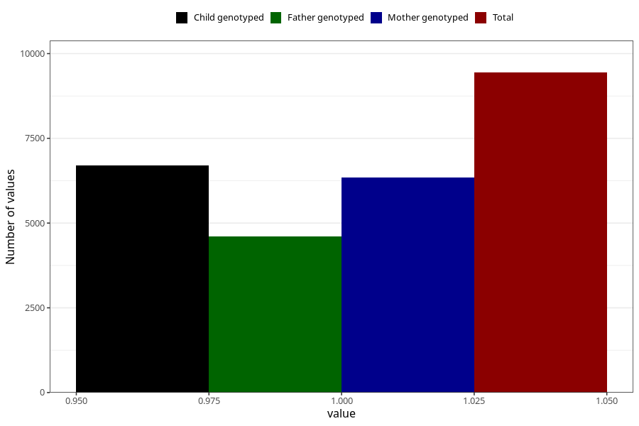

# long_term_nausea_vomiting_13w_16w
Variable mapping to questionnaire: q3, question CC388.
- Number of values:

| Value | Total | Child genotyped | Mother genotyped | Father genotyped |
| ----- | ----- | --------------- | ---------------- | ---------------- |
| Missing | 104182 | 68723 | 65420 | 45613 |
| Non-missing | 9441 | 6708 | 6349 | 4605 |
| 1 | 9441 | 6708 | 6349 | 4605 |

