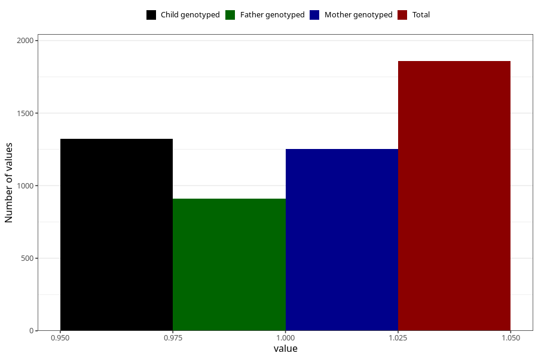

# long_term_nausea_vomiting_25w_28w
Variable mapping to questionnaire: q3, question CC391.
- Number of values:

| Value | Total | Child genotyped | Mother genotyped | Father genotyped |
| ----- | ----- | --------------- | ---------------- | ---------------- |
| Missing | 111765 | 81895 | 70516 | 49307 |
| Non-missing | 1858 | 1460 | 1253 | 911 |
| 1 | 1858 | 1460 | 1253 | 911 |

