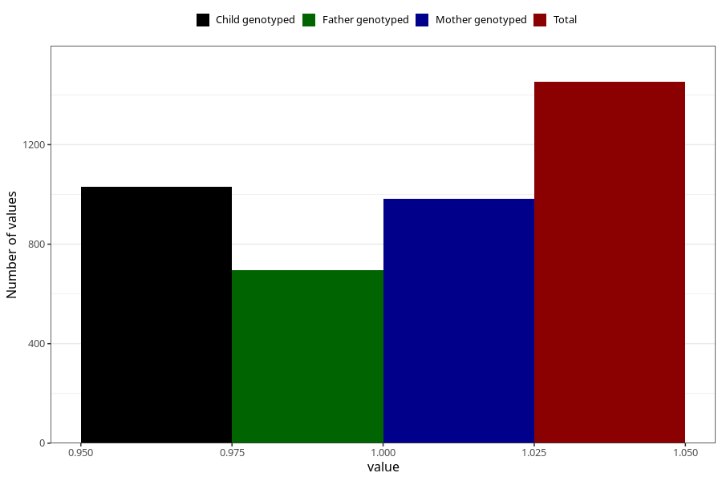

# long_term_nausea_vomiting_after_29w
Variable mapping to questionnaire: q3, question CC392.
- Number of values:

| Value | Total | Child genotyped | Mother genotyped | Father genotyped |
| ----- | ----- | --------------- | ---------------- | ---------------- |
| Missing | 112171 | 82211 | 70786 | 49521 |
| Non-missing | 1452 | 1144 | 983 | 697 |
| 1 | 1452 | 1144 | 983 | 697 |

