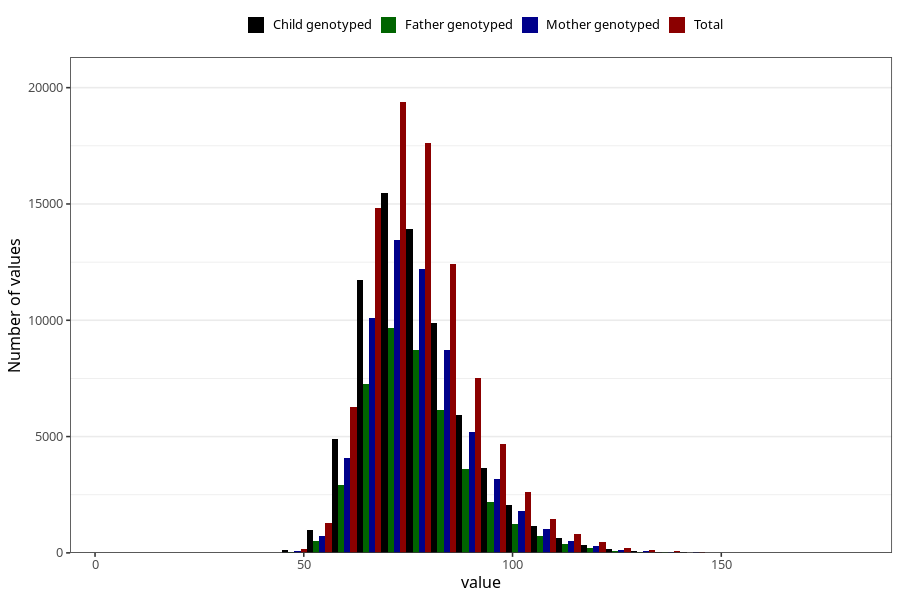

# mother_weight_last_check_30w
Variable mapping to questionnaire: q3, question CC131.
- Number of values:

| Value | Total | Child genotyped | Mother genotyped | Father genotyped |
| ----- | ----- | --------------- | ---------------- | ---------------- |
| Missing | 23651 | 12231 | 10130 | 6400 |
| Non-missing | 89972 | 71124 | 61639 | 43818 |
| 25th percentile | 68.6 | 68.7 | 69 | 68.9 |
| 50th percentile | 75.5 | 75.5 | 75.7 | 75.5 |
| 75th percentile | 84 | 84 | 84 | 84 |

