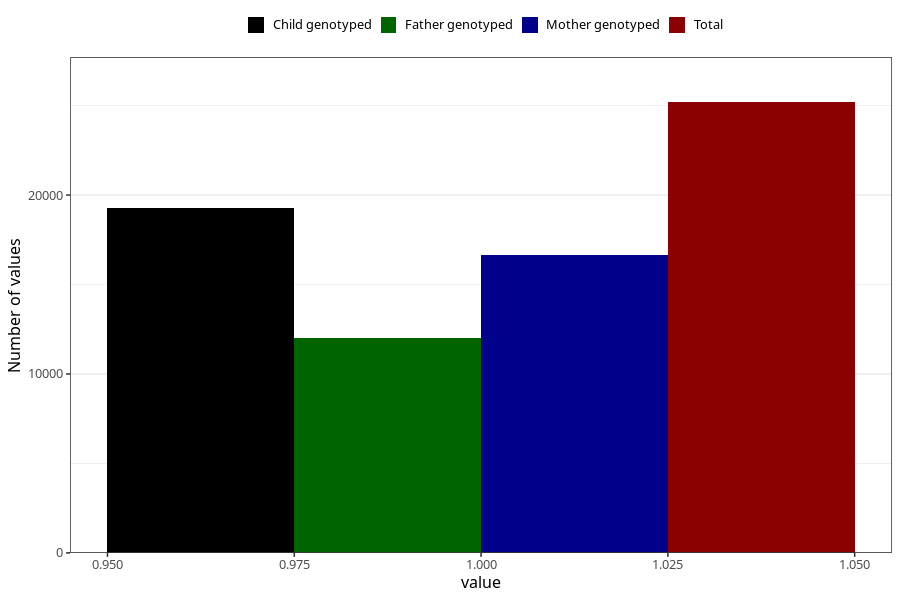

# nausea_13w_15w
Variable mapping to questionnaire: q1m, question AA219.
- Number of values:

| Value | Total | Child genotyped | Mother genotyped | Father genotyped |
| ----- | ----- | --------------- | ---------------- | ---------------- |
| Missing | 88434 | 57884 | 55108 | 38225 |
| Non-missing | 25189 | 17547 | 16661 | 11993 |
| 1 | 25189 | 17547 | 16661 | 11993 |

