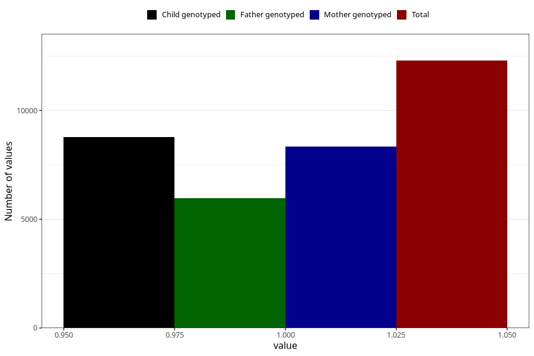

# nausea_17w_20w
Variable mapping to questionnaire: q3, question CC377.
- Number of values:

| Value | Total | Child genotyped | Mother genotyped | Father genotyped |
| ----- | ----- | --------------- | ---------------- | ---------------- |
| Missing | 101331 | 66661 | 63426 | 44253 |
| Non-missing | 12292 | 8770 | 8343 | 5965 |
| 1 | 12292 | 8770 | 8343 | 5965 |

